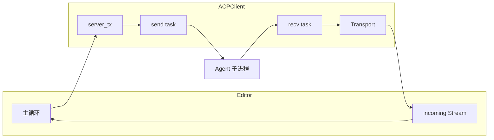

<!-- 42954976-1dd5-4127-aada-2c0f95335e05 -->
# ACP 协议实现计划

## 1. 协议与约束摘要

- **ACP**：JSON-RPC 2.0，与 LSP 一致；传输层为 **stdio**，但消息格式为 **换行符分隔**（每行一条 JSON），与 LSP 的 `Content-Length` + CRLF 不同，需单独实现解析/序列化。
- **约束**：不新增**外部** crate 依赖（仅使用现有 Cargo 依赖，不新加 crates.io 等第三方依赖）；允许在 workspace 内新建 crate（如 `helix-acp-types`、`helix-acp`）；复用 helix 现有机制；所有与 Agent 的通信必须异步，主循环不等待长时间 I/O 或 RPC。

## 2. 架构与数据流

- **Helix 作为 Client**：向 Agent 发 request/notification，接收 Agent 的 request/notification 与 response。多个已激活的 Agent 可**同时**参与通信，例如同一条 prompt 可并行发往多个 agent（见 3.5、3.6）。
- **异步保证**：发往 Agent 的请求通过**无界 channel** 的 `UnboundedSender<Payload>` 送入 transport（与 LSP 一致）；响应通过 `pending_requests: HashMap<Id, Sender<Result<Value>>>` 在 recv 任务中回调；Agent 发来的 request 在 handler 中处理（可 spawn 做 I/O），再通过同一 transport 回写 response，主循环只消费 `incoming` 事件，不 `await` 网络/磁盘。
- **需要等待的任务**：若有需等待的操作（如等待 Agent 响应、阻塞式 I/O、用户确认），**参考现有模块**（如 LSP 的 `capabilities.get_or_try_init`、DAP 的异步回调、`block_on` 的用法）的实现方式，利用 **tokio** 特性（如 `tokio::spawn`、`OnceCell`/`OnceLock` 异步初始化、`tokio::task::spawn_blocking` 做阻塞 I/O）或**单独线程**中等待，避免阻塞主循环与 recv/send 任务；可查阅 `helix-lsp`、`helix-dap`、`helix-view` 中类似场景的写法以保持风格一致。

## 3. 实现拆分

### 3.1 ACP 类型（新建 crate：helix-acp-types）

- **位置**：新建 workspace 内 crate **helix-acp-types**（与 `helix-lsp-types` 并列），不新增外部依赖，仅使用现有 serde、url 等已有依赖。
- **内容**（参考 [schema](https://agentclientprotocol.com/protocol/schema) 与 [initialization](https://agentclientprotocol.com/protocol/initialization)）：
  - **Initialize**：`InitializeRequest`（含 `protocolVersion`, `clientCapabilities`, `clientInfo`）、`InitializeResponse`（含 `protocolVersion`, `agentCapabilities`, `agentInfo`, `authMethods`）。
  - **Capabilities**：`ClientCapabilities`（如 `fs: { readTextFile, writeTextFile }`, `terminal`）、`AgentCapabilities`（如 `loadSession`, `promptCapabilities`, `mcpCapabilities`, `sessionCapabilities`）。
  - **Session**：`session/new`、`session/load`、`session/prompt`、`session/cancel`（notification）、`session/list`、`session/set_config_option`、`session/set_mode` 的 Request/Response/Notification 类型。
  - **Client 方法（Agent 调用我们）**：`fs/read_text_file`、`fs/write_text_file`、`session/request_permission`、`session/update`（notification）、`terminal/*` 的 Request/Response 类型。
  - **公共类型**：`SessionId`、`ProtocolVersion`、`ContentBlock`、`SessionUpdate`、`StopReason` 等，按 schema 定义；保留 `_meta` 等扩展字段（如用 `serde(flatten)` 或 `Option<Value>`）。
- **风格**：与现有 LSP 类型一致，使用 `Request`/`Notification` trait、`METHOD` 常量、`Params`/`Result` 的序列化/反序列化。

### 3.2 ACP 客户端与传输（新建 crate：helix-acp）

- **新建 crate**：新建 **helix-acp**（与 `helix-lsp` 并列），在根 `Cargo.toml` 的 `[workspace].members` 中增加 `helix-acp`；依赖 `helix-acp-types`、`helix-core`、`tokio`、`serde`、`serde_json` 等现有 workspace/外部依赖，**不依赖 helix-lsp**，**不新增**未在 helix 中使用的第三方 crate。
- **JSON-RPC 自实现（参考 LSP）**：**不重用** helix-lsp；在 helix-acp 内**参考** **helix-lsp/src/jsonrpc.rs** 自行实现 JSON-RPC 2.0 子模块（如 `helix-acp/src/jsonrpc.rs`），提供与 LSP 相同的协议形态：`Id`、`Params`、`Call`、`MethodCall`、`Notification`、`Output`、`Payload`、`Error`、`ErrorCode` 等，保证与 ACP 的 JSON-RPC 编码兼容，实现方式与 LSP 对齐便于维护。
- **传输层参考 LSP 实现**：参考 **helix-lsp/src/transport.rs** 的结构实现 ACP 传输层（例如 `helix-acp/src/transport.rs`）：
  - **整体结构**：与 LSP 一致——recv/send 两个 tokio 任务、本 crate 内 jsonrpc 的 `Payload` 枚举（Request / Notification / Response）、`pending_requests: HashMap<Id, Sender<Result<Value>>>`、通过**无界 channel**（`UnboundedSender`/`UnboundedReceiver`）向 send 任务提交待发消息。
  - **差异**：ACP stdio 使用 **newline-delimited JSON**（每行一条 JSON-RPC 消息），不采用 LSP 的 `Content-Length: n\r\n\r\n`。读取时按行读、每行 `serde_json::from_str` 解析；写入时 `serde_json::to_string` + `\n`。进程启动、stdin/stdout 的 `BufReader`/`BufWriter` 使用方式与 LSP 相同。
- **Client 结构**（参考 `helix-lsp/src/client.rs`）：
  - 持有 `server_tx: UnboundedSender<Payload>`（与 LSP 一致，无界 channel）、`request_counter`、`capabilities: OnceCell<AgentCapabilities>`（或等价）、`initialize_notify: Arc<Notify>`。
  - 提供 `initialize()` 发 `initialize` 请求并等待响应，在后台任务中完成并 `notify`，不阻塞主线程；若 initialize 响应要求认证，则提供 `authenticate()` 等，完成后再视为可进行 session 操作。
  - **连接完成**的定义：完成 initialize（及可选的 authenticate），直至**能够新建或加载会话**（可调用 `session/new` 或 `session/load`）；此时才将 client 视为“已连接”并注册到 Registry。
  - 提供 `session_new()`、`session_prompt()` 等，内部构造 `MethodCall` 经 `server_tx` 发送，返回 `impl Future<Output = Result<Response>>`（或通过 `tokio::sync::oneshot`/channel 在 recv 任务中回调），**禁止**在 helix-view 主循环中 `block_on` 这些 future。发送 prompt 时若该 client 尚无会话，**默认先调用 session/new 再 session/prompt**（见 3.6）。
- **Registry / 多 Agent**（若需要）：可类似 `helix-lsp::Registry`，用 `SlotMap<AgentId, Arc<AcpClient>>` 与 `incoming: SelectAll<UnboundedReceiverStream<(AgentId, Call)>>`；若首版只支持单 Agent，可简化为单 client + 单 `UnboundedReceiver<(AgentId, Call)>`。
- **Agent 发来的 Request 的响应**：recv 任务收到 `Call::MethodCall` 时，根据 `method` 分发到“Client 方法” handler（见下），handler 返回 `Result<Value>`；在 recv 任务或单独 spawn 的 task 中发送 JSON-RPC response 回 Agent。Handler 内若需**等待**（如读文件、等用户授权、等子进程输出），参考 LSP/DAP 等模块：使用 `tokio::spawn`、`spawn_blocking` 或单独线程完成等待，再通过 channel 将结果传回负责回写 response 的 task，**不阻塞** recv 循环。

### 3.3 helix-view：集成与事件循环

- **Editor 状态**：增加 `acp: AgentRegistry`（与 `language_servers`、`debug_adapters` 并列），支持多 Agent；`incoming` 合并进主循环的 `select!`，例如 `Some(msg) = self.acp.incoming.next() => EditorEvent::AcpMessage(msg)`。默认 agent 列表仅从 `config().acp.default_agents` 解析（可多个）；**仅当 default_agents 非空时**用于自动启动。**:acp-prompt** 未提供 agent 名字时向**所有已激活**的 agent 发送提示词。
- **主循环**：在 `next_event()` 的 `select!` 中增加对 ACP incoming 的消费，将 `EditorEvent::AcpMessage` 派发到 ACP 专用 handler（类似 `handlers/lsp.rs`），在 handler 中只做状态更新、UI 相关、以及向 ACP client 发送 notification/request（通过 `server_tx`），**不**在该路径上执行会阻塞的 I/O 或 `block_on`。
- **Client 方法实现**（Agent 调用我们）：
  - `fs/read_text_file`：在 handler 或专门模块中，根据 path 与 session 决定是否从已打开 Document 读或从磁盘读；若从磁盘，spawn 到 blocking pool，完成后通过 channel 将结果交给发送 response 的 task。
  - `fs/write_text_file`：同上，写文件在 spawn 中完成，再回传 response。
  - **需用户输入的请求（认证、权限等）**：参考 **LSP 的 `window/showMessageRequest`** 实现（见 `helix-term/src/application.rs`）：当 Agent 发来需要用户输入的 request（如 `authenticate` 需输入 token/密码、`session/request_permission` 需选择允许/拒绝）时，**不**在收到请求时同步回复；改为**推送 UI 组件**（如 `ui::Prompt` 输入认证信息、`ui::Select` 选择权限选项），在回调中携带 **request id** 与 **agent 引用**，用户确认或取消时在回调里调用 **`acp_client.reply(id, result)`** 将结果回发给 Agent。与 LSP 一致：请求在主循环中收到 → 推一层 Select/Prompt → 立即 return；用户操作后由 compositor 触发回调，回调中通过 `editor` 取到对应 AcpClient 并 `reply(id, result)`，无需单独 channel 或阻塞。
  - `session/request_permission`：按上条，用 **Select/Menu** 展示权限选项，回调中 `acp_client.reply(id, outcome)`。
  - `session/update`：为 notification，仅更新 Editor/View 状态（如进度、消息块），不回复。
  - `terminal/*`：与现有 DAP/terminal 集成点对接，在 spawn 或已有 async 路径中执行，结果再回写 response。
- 所有“需用户交互”或“需长时间 I/O”的 Client 方法，均通过上述 UI 回调或 channel + spawn 与主循环解耦，保证主循环不等待。

### 3.4 配置（config.toml）

- **位置**：在用户/工作区 **config.toml** 中增加 `[acp]` 段（与 `[lsp]` 同级），由现有 `Config` 加载逻辑（`helix-view` 中 `Config` 结构体、`helix-loader` 的 `config.toml` 路径）读取。
- **AcpConfig 结构**（示例，具体字段名可随实现微调）：
  - **`default_agents: Vec<String>`（或 `Option<Vec<String>>`）** — 默认 agent 名称列表，**支持配置多个**。**必须是 `agents` 数组中某条的 `agent.name`**，即 default_agents 中的每个字符串必须在 `acp.agents` 的某一项里存在对应的 `AgentConfig.name`；配置加载或校验时若发现 default_agents 中有不在 agents[].name 中的项，可忽略或报错。**仅当 default_agents 非空时**随 Editor 启动自动连接，且**只**连接 default_agents 中列出的 agent（不因“仅配置了一个 agent”而自动连接）；default_agents 为空时需在命令中显式指定并手动连接。命令未指定 name 时的行为依命令而定：**:acp-prompt** 未传 name 时向**所有已激活**的 agent 发送；其他命令可以 default_agents 为默认目标。
  - **`agents: Vec<AgentConfig>`** — 多个 agent 定义；在 Editor 使用的 Config 中为 **Vec**，即 `acp.agents: Vec<AgentConfig>`。
- **单 Agent 配置项**（`AgentConfig`，即 Vec 的元素类型）：
  - **`name: String`** — 该 agent 的名称，唯一标识；**default_agents 中的值必须来自各 `agents` 项的 `name`**。
  - `command: String`、`args: Vec<String>` — 子进程启动命令（同 LSP 的 command/args）。
  - **功能过滤（参考 language_server 机制）**：与 **helix-core 中 `LanguageServerFeatures`** 的过滤方式一致（见 `helix-core/src/syntax/config.rs`）：采用 **`only` / `excluded`**（或配置层 `only-features` / `except-features`）**HashSet** 加 **`has_feature(feature) -> bool`** 的判定逻辑。即 `(only.is_empty() || only.contains(&feature)) && !excluded.contains(&feature)`；支持 Simple(name) 与带 only/except 的配置形式。功能标签示例：`plan`、`translate`、`completion`、`code-edit` 等；未配置 only/excluded 时视为通用 agent，参与“全部”筛选。
  - 可选：`cwd`、`env`、`timeout` 等，与现有 LSP 配置风格一致。
- **默认值**：`agents = []`，`default_agents = []`；未配置任何 agent 时，仅通过命令手动连接。**仅当 `default_agents` 非空时**自动启动，Editor 启动时**只**自动连接 default_agents 中配置的 agent（可多个）。不提供 acp.enable 字段，不做“是否启用 ACP”判断。

### 3.5 启动行为与多 Agent

- **Agent 连接逻辑**：一次完整的“连接”包含：spawn Agent 子进程 → **ACP initialize**（协商版本与能力）→ **认证**（若 Agent 在 initialize 响应中要求 auth，则调用 `authenticate`；若认证需用户输入如 token/密码，则通过**请求需用户输入**的同一套机制：在主循环侧推送 Prompt/Select，用户在回调中提交后通过 `acp_client.reply(id, result)` 回发 authenticate 响应，连接流程在后台根据结果继续或失败）→ 直至**能够新建或加载会话**（即可以调用 `session/new` 或 `session/load`）。只有完成上述步骤后该 agent 才视为“已连接”，可参与 prompt 等操作；全部在后台异步执行，不阻塞主循环。
- **随 Editor 启动**：**仅当 `acp.default_agents` 非空时**进行自动连接：在 Editor 初始化完成后，**只**对 default_agents 列表中列出的 agent 自动执行上述**完整连接逻辑**（含 initialize、认证、直至可新建/加载会话），支持同时自动启动多个；**若某 agent 已连接成功则跳过**，不再对其发起连接。不在主循环中阻塞，连接过程在后台完成。不因“仅配置了一个 agent”而自动连接；即自动连接**仅**针对 default_agents 中配置的 agent。
- **多 Agent**：支持在 `config.toml` 中配置多个 agent（不同 name）；Editor 侧使用 **Registry**（`SlotMap<AgentId, Arc<AcpClient>>` + 按 name 索引），与 `language_servers` 类似；`incoming` 为 `SelectAll<UnboundedReceiverStream<(AgentId, Call)>>`，主循环按 `(AgentId, Call)` 分发。
- **多 Agent 同时接收通信**：多个已激活（已连接）的 Agent **可同时**参与 ACP 通信。例如一次 **prompt** 可发送给**多个**已选中的 agent（见 3.6）：命令支持指定多个 agent 名称（如逗号分隔或 Picker 多选），同一条 prompt 并行发往所有指定 agent，各 agent 独立 session、独立响应；其他需“指定目标 agent”的操作也可设计为支持多选，保证多 agent 可并发收发包。
- **Agent 功能过滤**：参考 **language_server 过滤机制**（`LanguageServerFeatures`：`only` / `excluded` + `has_feature`）。每个 agent 配置中提供 **only** / **excluded**（或等价的 only-features / except-features），命令与 UI 在按功能筛选时调用 **`has_feature(feature)`**：仅当 `(only.is_empty() || only.contains(feature)) && !excluded.contains(feature)` 时纳入该 agent。补全、Picker 多选等仅列出/展示通过当前 feature 过滤的 agent，与 LSP 按 `language_servers.has_feature(feature)` 筛选逻辑一致。
- **默认 Agent**：当存在多个 agent 时，通过 `acp.default_agents`（**支持多个**，为列表）指定自动连接与部分命令的默认目标。**:acp-prompt 在未提供 agent 名字时向所有已激活的 agent 发送提示词**（不限于 default_agents）；其他命令若未指定 name 可按需使用 default_agents 或选择器/功能过滤选定。

### 3.6 Typable 命令（: 命令）

在 **helix-term** 的 `commands/typed.rs` 中注册以下 TypableCommand（与 `lsp-restart`、`lsp-stop`、`debug-start` 等同一套机制），并配套 **completer** 使用已配置/已连接的 agent 名称补全。

- **:acp-connect [name]**  
  - 对指定 name 的 agent 执行**完整连接逻辑**（ACP initialize、认证若需要、直至可新建/加载会话）；若未传 name 则对 default_agents 列表中各 agent 执行连接。**已连接成功的 agent 要跳过**，不再对其发起连接。  
  - **已连接的 agent 不得作为参数传入**：completer 与参数校验只允许“未连接”的 agent 名称；若用户传入已连接的 name，应忽略或提示该 agent 已连接，不重复连接。  
  - 可多次调用以**同时启动多个 agent**（每个 name 对应一个进程与 Client 实例）。  
  - 实现：从 `config.load().acp.agents` 取对应 AgentConfig，**若该 name 已在 Registry 中已连接则跳过**；否则 spawn 进程后执行 initialize → 若需认证则 authenticate → 就绪后注册到 Registry，可进行 session/new 或 session/load；不在主循环 block_on。

- **:acp-history [name]**  
  - 展示指定 agent 的**会话历史**（当前 session 的用户消息与 agent 回复、tool call 等）；若未传 name 则用 Picker 选择已连接 agent。以 Popup/overlay 形式展示，支持滚动；数据来自本地缓存的 session 消息（见 3.7 会话历史展示）。Completer：已连接的 agent 名称。

- **:acp-close [name]**  
  - 关闭指定 name 的 agent 连接；若未传 name 可弹出已连接 agent 列表供选择（或关闭默认/当前）。  
  - Completer：已连接的 agent 名称（参考 `active_language_servers`）。

- **:acp-prompt [name…] [content]**  
  - 向指定 name 的 agent 发送提示词（session/prompt）；**若未提供 agent 名字，则向当前所有已激活（已连接）的 agent 发送**，同一条 prompt 并行发往全部。  
  - **发送时若 agent 尚无会话**：执行发送提示词时，若该 agent **尚未新建或加载会话**，则**默认先新建会话**（调用 `session/new`），再发送提示词；即“无 session 则先 session/new 再 session/prompt”，保证 prompt 总能发到有效会话。  
  - **支持多个 agent**：name 可为一个或多个（如逗号分隔 `agent1,agent2` 或 Picker 多选），同一 content **并行**发往所有指定且已激活的 agent，各 agent 独立 session、各自收发包。  
  - **按功能过滤**：可选通过 feature 筛选候选 agent，使用与 language_server 一致的 **has_feature(feature)** 逻辑（only / excluded）；例如 `:acp-prompt translate` 仅列出 `has_feature("translate")` 为 true 的 agent，再从中单选/多选。  
  - 若 content 未传，可从当前选区或弹窗输入（参考 `prompt()`/`Prompt`）；若已传则直接发送。  

Completer 与签名：
- `acp-connect`：Completer **仅列出未连接的** agent 名称（从 `config().acp.agents` 取，并**排除** Registry 中已连接的 name）；已连接的 agent **不得**作为参数传入。按功能过滤时使用 **has_feature(feature)**（与 language_server 的 only/excluded 机制一致）；positionals 可选 0 或 1。
- `acp-history`：Completer 为当前已连接的 agent 名称（从 Registry 取）；positionals 可选 0 或 1。
- `acp-close`：Completer 为当前已连接的 agent 名称（从 Registry 取），可按 **has_feature** 过滤；positionals 可选 0 或 1；可支持多选以一次关闭多个。
- `acp-prompt`：Completer 为已连接的 agent 名称，按 **has_feature(feature)** 过滤后补全/展示；支持**多选**（多个 name），positionals 按“可选 feature 或 agent（可多个）+ 可选 content”设计；实现时对每个目标 agent：若尚无会话则先 session/new 再 session/prompt，否则直接 session/prompt；多个 name 并行处理，不串行等待。

### 3.7 UI 设计（参考现有 UI）

- **参考点**：与 LSP/DAP 的 UI 保持一致风格；参考 `helix-term/src/ui/` 下的 **Picker**、**Prompt**、**Popup**、**Compositor** 层、**statusline**、**overlay**。
- **连接/状态**：
  - 在 **statusline** 或 **info area** 中可显示当前已连接的 ACP agent 名称（或“默认”标识），与 LSP 显示方式类似（如 spinner/状态文案）；不强制新组件，优先复用现有 statusline 元素或新增一个可配置的 statusline 元素。
- **发送提示词**：
  - 当 `:acp-prompt` 不带 content 时：使用 **Prompt** 层（`ui::prompt`）输入内容，确认后发送；可带 history 与补全（例如补全 agent 名、历史 prompt）。
  - 当需要选择“向哪个 agent 发送”时：可用 **Picker** 列出已连接 agent，支持按 **has_feature(feature)** 过滤（与 language_server 的 only/excluded 机制一致），支持**多选**，选中一个或多个后再弹出 Prompt 或直接带参，同一条 prompt 并行发往所有选中 agent；或使用 **Menu** 做简单选择（可按功能分组）。
- **session/update 与进度**：
  - Agent 通过 `session/update` 推送的进度、消息块等：在 **statusline 下方**或 **overlay** 中展示（参考 LSP 的 progress、window/showMessage）；可复用 `display_messages` / `display_progress_messages` 的展示区域或扩展为 ACP 专用一行/一块。
- **认证 / session/request_permission（需用户输入）**：
  - **参考**：与 **LSP `window/showMessageRequest`** 一致（`helix-term/src/application.rs`：用 `ui::Select` 展示 actions，回调中 `language_server.reply(id, result)`）。Agent 的 `authenticate` 或 `session/request_permission` 需要用户输入时：收到请求后**不立即回复**，而是 **push 一层 UI**（认证用 `ui::Prompt` 输入 token/密码等，权限用 `ui::Select` 选允许/拒绝），回调闭包中捕获 **request id** 与 **agent_id**；用户确认或取消时在回调里通过 `editor` 取到对应 AcpClient 并调用 **`reply(id, result)`** 回发 response。Select 使用 `compositor.replace_or_push` 等，与 LSP 弹窗一致。
- **多 Agent 选择**：
  - 当存在多个已连接 agent 且命令未指定 name 时：用 **Picker** 列出 agent 名称，选中后作为后续操作的 target（与 `configured_language_servers` / `active_language_servers` 的 completer 行为一致）；或直接在 Typable 命令的 completer 中列出，用户通过补全选择。
- **会话历史展示**：
  - 在 helix-view 或 helix-term 中**按 session（或按 agent）维护会话历史**：用户发送的 prompt、Agent 通过 `session/update` 推送的消息块与 tool call 等，可缓存在内存（如 `Vec<(Role, Content)>` 按 session_id 索引），用于展示与回放。
  - 提供**会话历史展示**入口：例如 **`:acp-history [name]`** Typable 命令，若未传 name 则 Picker 选择已连接 agent；选中后以 **Popup** 或 **overlay**（参考 `ui::Markdown`、LSP message 展示）展示该 agent 当前 session 的对话历史（用户消息、助手消息、可选 tool call 等），支持滚动查看；样式与现有 message/help 弹窗一致。
  - 数据来源：发送 prompt 时追加用户消息；收到 `session/update` 时追加 agent 消息块；无 session 时展示为空或提示先发送 prompt。
- 不在本阶段引入新 UI crate；所有 UI 基于现有 `helix-term` compositor、picker、prompt、popup、statusline 能力实现。

## 4. 关键文件与引用

| 用途 | 文件/位置 |
|------|-----------|
| ACP 类型（新建） | `helix-acp-types/`（与 helix-lsp-types 并列） |
| ACP Client / Transport（新建） | `helix-acp/` |
| LSP 类型与 Request trait 参考 | `helix-lsp-types/src/request.rs`, `lib.rs` |
| language_server 功能过滤参考 | `helix-core/src/syntax/config.rs`（`LanguageServerFeatures`：only / excluded、`has_feature`） |
| LSP Client / Transport 参考 | `helix-lsp/src/client.rs`, `transport.rs` |
| JSON-RPC 自实现参考 | `helix-acp` 内自实现 `jsonrpc.rs`，参考 `helix-lsp/src/jsonrpc.rs`，不依赖 helix-lsp |
| 主循环与 LSP 事件 | `helix-view/src/editor.rs`（`next_event`, `language_servers.incoming`）, `handlers/lsp.rs` |
| DAP 集成参考 | `helix-view/src/editor.rs`（`debug_adapters.incoming`）, `helix-dap` |
| 编辑器 Config 与 LSP 配置 | `helix-view/src/editor.rs`（`Config`, `LspConfig`）, `helix-loader` config.toml 路径 |
| Typable 命令与 completer | `helix-term/src/commands/typed.rs`（TYPABLE_COMMAND_MAP, lsp-restart/lsp-stop）, `helix-term/src/ui/mod.rs`（completers） |
| 需用户输入的 request 回复方式 | `helix-term/src/application.rs`（ShowMessageRequest：Select + 回调内 `language_server.reply(id, result)`）, `helix-lsp/src/client.rs`（`reply`） |
| UI 组件 | `helix-term/src/ui/`（picker, prompt, popup, overlay）, statusline, compositor 层 |

## 5. 测试与兼容

- **单元测试**：ACP 类型序列化/反序列化（与 schema 示例 JSON 对照）；newline-delimited 编解码；Client 方法 params/result 与 schema 一致。
- **集成**：启动一个 mock Agent（stdio，按 newline 回包），测试 initialize → session/new → session/prompt 与 session/update 的收发，以及 Client 方法 request/response 往返。
- **不破坏现有 LSP/DAP**：ACP 代码路径独立（新 mod、新 Editor 字段、新 event 分支），不修改 LSP Transport 的 Content-Length 逻辑。

## 6. 实施顺序建议

1. **新建 helix-acp-types**：在根目录 `Cargo.toml` 的 `[workspace].members` 中增加 `helix-acp-types`；新建该 crate，定义 Initialize、Session、Client 方法相关类型及 Request/Notification，仅使用现有依赖（如 serde、url），不新增外部 crate 依赖。
2. **helix-view Config**：在 `Config` 中增加 `acp: AcpConfig`，定义 `AcpConfig`（default_agents 为 **Vec<String>** 且必须为 agents 中某条的 name，**agents 为 Vec<AgentConfig>**，不含 enable 与 auto_start）与 `AgentConfig`（单条 agent 配置，含 **name** 字段；default_agents 必须是 agents[].name 的子集）；在 Editor 中 agent 配置以 **Vec<AgentConfig>** 形式存在。不提供 enable 字段，不做“是否启用 ACP”判断。在 `Default` 与反序列化中提供默认值；确保 config.toml 的 `[acp]` 段可被正确加载。
3. **新建 helix-acp**：在 `Cargo.toml` 的 workspace members 中增加 `helix-acp`；实现 ACP stdio 读写（newline-delimited）、`AcpTransport`、`AcpClient`（含 `initialize`、`session_new`、`session_prompt` 等，无界 channel 与 LSP 一致）、**Registry**（多 Agent、按 name 索引、SelectAll incoming）；将 Agent 发来的 Call 送入 `incoming`；实现 Agent 请求的 response 回写与简单 handler 占位。不新增外部 crate 依赖。
4. **helix-view**：Editor 中挂接 `acp: AgentRegistry`、`next_event` 中消费 ACP incoming、ACP handler 中处理 `session/update` 等并实现 Client 方法（含 spawn 的 I/O 与 permission）；**仅当 `default_agents` 非空时**在初始化后自动连接，且**只**连接 default_agents 中配置的 agent（列表内全部）。
5. **helix-term Typable 命令**：在 `typed.rs` 中注册 `acp-connect`、`acp-close`、`acp-prompt`、**`acp-history`**，并实现对应 completer；连接时跳过已连接的 agent，`:acp-connect` 的 completer 仅列出未连接的 agent、已连接的不得作为参数传入；支持多 agent 同时运行与通过参数指定 name。
6. **UI**：按 3.7 节在 statusline/overlay 展示 ACP 连接状态；`:acp-prompt` 无 content 时用 Prompt 层；多 agent 选择用 Picker/补全；**会话历史展示**（`:acp-history` + 按 session 缓存消息 + Popup/overlay 展示）；session/update 与 request_permission 用现有 popup/overlay 风格。
7. **E2E 与文档**：集成测试、config.toml 示例、文档更新。

按此顺序可在**不新增外部 crate 依赖**、不阻塞主循环的前提下，在 Helix 内完成 ACP 客户端实现（允许新建 workspace 内 crate 如 helix-acp-types、helix-acp），配置在 config.toml、支持多 Agent 与 Typable 命令，并与现有 LSP/UI 机制对齐。
